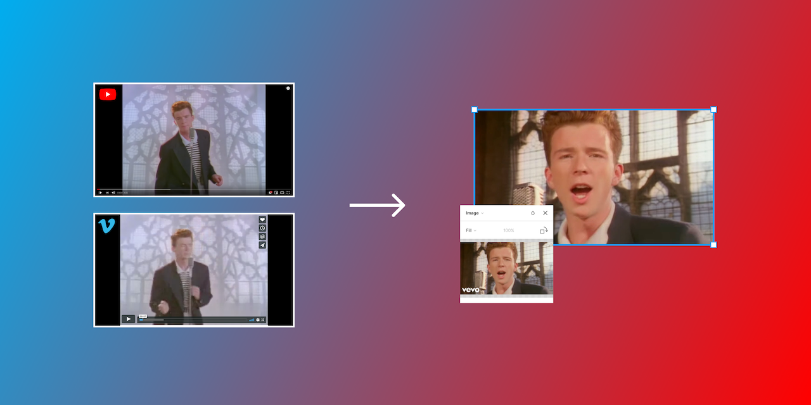

# Figma Video Cover

Figma plugin to get the cover image of a YouTube or Vimeo video from its url.

## How it works?

It opens a **Figma** panel and you insert the YouTube or Vimeo url. If one or more layers are selected, a fill with the video cover image will be added to all of them. If no layer is selected, a new layer will be created with the video cover fill added.

## Development

To develop a Figma plugin you need to install the desktop app. Learn more in the [Figma Plugin docs](https://www.figma.com/plugin-docs/setup/).

Available commands:

- `npm run dev`: starts the watcher for changes. Modify the files under the `src` folder and the code will be compiled automatically. Then, go to the Figma app and run your development plugin.
- `npm run build`: generates the production build in the `dist` folder. Before generating the build, it checks the TypeScript code for linting errors.
- `npm run test`: simple test that ensures that the `ui.html` and `plugin.js` files have been generated in the `dist` folder.
- `npm run lint`: lint TypeScript code.
- `npm run lint:fix`: lint and apply automatic fixes to TypeScript code. This script runs before `build`.

## Having problems?

Take a look if someone already opened [a similar issue](https://github.com/aarongarciah/figma-video-cover/issues?utf8=%E2%9C%93&q=is%3Aissue+sort%3Aupdated-desc+) or open a [new one](https://github.com/aarongarciah/figma-video-cover/issues/new).

## Artwork (Figma)

See the artwork for the Figma icon and cover in the [Figma file](https://www.figma.com/file/opcLVoEFiMH6B9bvlKp9Cd/).

## Roadmap
- [ ] Support more video platforms.

---

Made with ♥️ by [Aarón García Hervás](https://twitter.com/aarongarciah)
