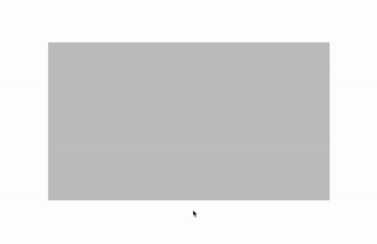

# Figma Video Cover

Figma Plugin to get the cover of YouTube and Vimeo videos from their urls.

## How it works?

It opens a Figma panel and you insert the YouTube or Vimeo url. If one or more layers are selected, a fill with the video cover image will be added to all of them. If no layer is selected, a new layer will be created with the video cover fill added.

## Development
Available commands:
- `npm run dev`: starts the watcher for changes. Modify the files under the `src` folder and the code will be compiled automatically. Learn how to develop plugins for Figma [reading the docs](https://www.figma.com/plugin-docs/setup/).
- `npm run build`: generates the production build in the `dist` folder. Before generating the build, it checks the TypeScript code for linting errors.
- `npm run test`: simple test that ensures that the `ui.html` and `plugin.js` files have been generated in the `dist` folder.
- `npm run lint` and `npm run lint:fix`: lint the code and lint and apply the code respectively. `npm run lint:fix` is run before the `build` script.

### Having problems?

Take a look if someone already opened [the same issue](https://github.com/aarongarciah/figma-video-cover/issues?utf8=%E2%9C%93&q=is%3Aissue+is%3Aclosed+sort%3Aupdated-desc+) or open a [new one](https://github.com/aarongarciah/figma-video-cover/issues/new).

### Artwork (Figma)

See the artwork for the Figma icon and cover and the Github in [the Figma file](https://www.figma.com/file/opcLVoEFiMH6B9bvlKp9Cd/).

---

Made with ♥️ by [Aarón García Hervás](https://twitter.com/aarongarciah)
